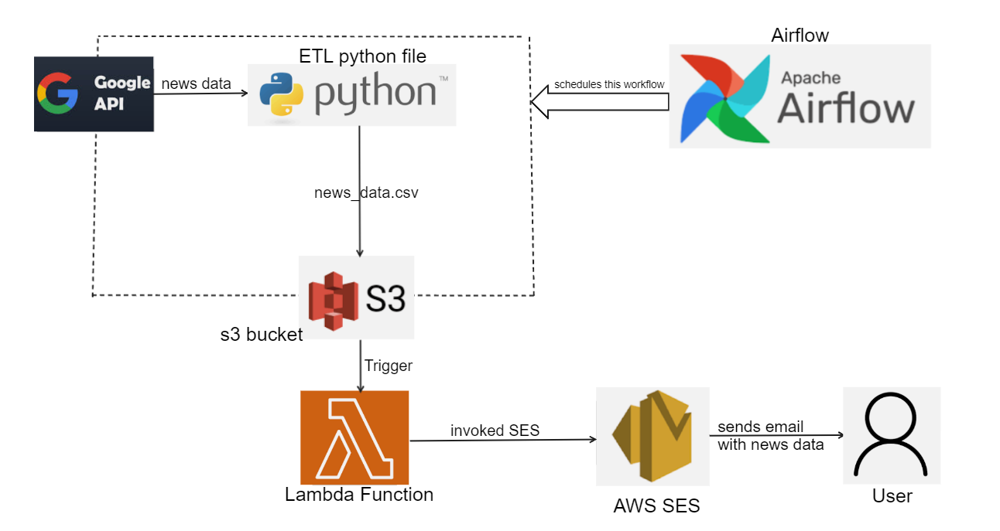

# ETL Pipeline for Collecting News Data from Google and Uploading to S3
# Overview
This project sets up an ETL (Extract, Transform, Load) pipeline to collect news data from Google and upload it to an S3 bucket. The pipeline is automated using Airflow, and a Lambda function is included to send an email to the user whenever new data is put into the S3 bucket.
## Sections
- [Architechture](#Architechture)
- [Prerequisites](#Prerequisites)
- [Setup](#Setup)
- [Installation](#Installation)
- [Conclusion](#Conclusion)

# Architecture

The architecture of the project consists of the following components:
* Google News API: A source of news data that provides the latest headlines from various sources around the world.
* Airflow: An open-source platform used for scheduling, monitoring, and managing workflows.
* AWS S3: A cloud-based object storage service used to store the news data.
* AWS Lambda: A serverless computing service that executes code in response to events, in this case, the addition of new data to the S3 bucket.
* AWS SES: A cloud-based email service used to send email notifications to the user.
# Setup
* Set up an AWS S3 bucket: Create an S3 bucket to store the news data.
* Set up an AWS IAM role: Create an IAM role with the necessary permissions to access S3 and SES.
* Set up an AWS Lambda function: Create a Lambda function that will send an email using SES whenever new data is put into the S3 bucket.
* Set up an Airflow DAG: Create an Airflow DAG (Directed Acyclic Graph) to schedule the ETL pipeline workflow.
* Run the ETL pipeline: Run the Airflow DAG to start the ETL pipeline, which will collect news data from the Google News API, transform it, and upload it to the S3 bucket.
* Receive email notifications: Whenever new data is added to the S3 bucket, the Lambda function will automatically invoke SES to send an email notification to the user.
# Prerequisites
* Python 3.6 or higher
* AWS account
* Airflow 1.10.12 or higher
# Installation

### Set up an AWS S3 bucket
* Place it in the same region
* Uncheck - block all public access option
* Ensure your iam role has all ec2 and s3 access
### Set up an AWS SES
* An identity is an email address that sends/receives the email from SES
* Once created verify your email address in your email inbox
### Set up an AWS IAM role (for Lambda Function)
* Ensure your iam role has all SES and s3 access
### Set up an AWS Lambda function
* use a blueprint (get s3 object).
* Use the new role created above for this lambda function that has access to SES and S3.
* Choose your s3 bucket for the trigger.
* Once the lambda function is created, create a layer for Pandas.
* Deploy the lambda.py code in aws lambda code panel after adding  the source and destination email address and also the source email address identity arn.
* Run app.py locally. It should uplaod to s3 bucket. This Upload event should trigger lambda function. Then the lambda function should invoke ses to send email to destination address.
* s3 --> Lambda --> SES
* To view logs of lambda, you can see it in cloudwatch > log_groups
* If successful , you must have received an email containing news!!!!!
## Set up an Airflow DAG
### Running Airflow on ec2 Instance 
* Create an ec2 instance (OS Image - Ubuntu) of size at least t3.medium (same region as lambda function and s3)
* Allow https from internet
* Modify the security groups of the ec2 - inoudn rule - add rule - new TCP rule source - my ip
* Once ec2 is running . SSH into it 
** chmod 400 test-keypair.pem
ssh -i "test-keypair.pem" ubuntu@ec2-34-205-87-187.compute-1.amazonaws.com
sudo apt-get update - download package info from internet
Install python - sudo apt install python3-pip
Install all the dependencies of app.py using pip
sudo pip install pandas requests boto3 s3fs python-dotenv xmltodict
Now we are ready to install apache airflow - sudo pip install apache-airflow
Start the airflow using - airflow standalone
Once the airlfow server has started. Take a note of the admin cred of airflow
Now open the Public DNS of the ec2 at port 8080. You should land on the airflow login page
After logging in You can see the default dags in the home page. Now we need to add our own dag into this
Open a new bash shell while the server is still up in the prev shell
Ls -  u will find airflow directory
Cd airflow - 
Ls - u will find directories below
airflow-webserver.pid  airflow.cfg  airflow.db  logs  standalone_admin_password.txt  webserver_config.py
Mkdir my_dag - create a directory where we can keep our code
Cd my_dag
Clone the repo here
Add .env file containing the aws secrets
Cd ..
Sudo nano airflow.cfg - edit 
dags_folder = /home/ubuntu/airflow/my_dag
Once done we can restart the airflow server in the other bash shell
Refresh the airflow page and you should be able to see you dag
Click on it and open it and run it
~~~~~~~~~~~~~~~~~~~~~~~~~~~~
Once airflow dab is running and scheduled we will be getting emails after every interval.

Verify in S3 that you have received the news data.
Also you must have received an email that delivers the news.
# Conclusion
This project demonstrates how to set up an automated ETL pipeline to collect news data from Google and upload it to an S3 bucket. By using Airflow to schedule the pipeline and AWS Lambda to send email notifications, the workflow can be fully automated and require minimal manual intervention.

